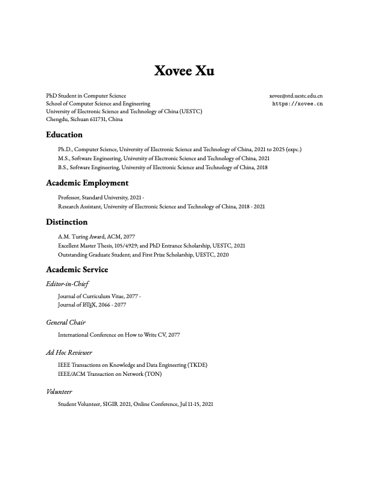

# LaTeX Curriculum Vitae Template

This repo provides a CV template designed by [Xovee Xu](https://www.xoveexu.com).

- If you like this template, consider give me a star!

- If you have any suggestions, contact me at `xovee at live.com`

- See a sample below. You can have a look at my personal academic CV [here](https://www.xoveexu.com/archive/cv/cv.pdf).

## Usage

Just play [cv.tex](https://github.com/Xovee/latex-cv/blob/main/cv.tex) or use [Overleaf](https://www.overleaf.com/latex/templates/xovees-cv-template/rrsmqwhbygcf).

### Font

This template uses `ebgaramond` font. 

I personally use [`garamondx`](https://www.ctan.org/pkg/garamondx), you can install this font via [`getnonfreefonts`](https://www.google.com/search?q=getnonfreefonts). 

Other fonts like Times New Roman, Roboto, Open Sans, Helvetica can be easily used via `\usepackage{some-font}`; reference: [The $\LaTeX$ Font Catalogue](https://tug.org/FontCatalogue/). 

### BibTeX

If you want to use `bibtex` or other similar packages, create your bibliography file `.bib` and import it into `cv.tex`. For myself, I manually type all of my papers (full control :satisfied:). 

## Quick TIPs

- Tailor it to meet your demands, showcase the most important.
- Less (formant) is often more. Consistency is critical. 

## Useful Resource

- [Academic Job Search - CV (from UC Berkeley)](https://career.berkeley.edu/PhDs/PhDCV)

## LICENSE

MIT

## Contact

`xovee at live.com`
