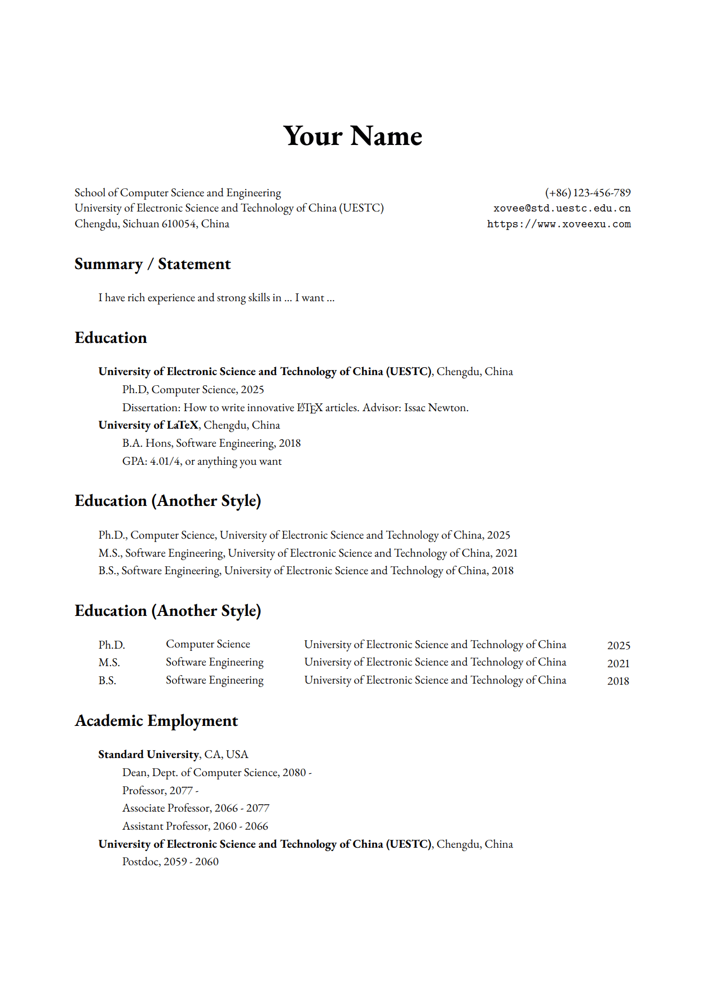

# [Xovee Xu](https://xovee.cn)'s Curriculum Vitae

This repo provides a CV template designed by Xovee Xu. 

If you want to use this template or you like it, give me a star!

If you have any suggestions, contact me at `xovee at ieee.org`

Following is the first page of PDF which generated by `cv.tex`. You can also see my personal CV [here](https://xovee.cn/archive/cv/cv.pdf).

## Usage

The use of this template should be fairly straightforward: see `cv.tex`.

### Font

In this template, `ebgaramond` font has been used. I personally used `garamondx`, you need additional steps to install this font. Of course, you can easily adopt other kinds of fonts. 

### BibTeX

If you want to use `bibtex` or other similar packages, create your bibliography file `.bib` and import it into `cv.tex`, rather than manually type articles which I did in this template. 

## LICENSE

MIT

## Contact

`xovee at ieee.org`

